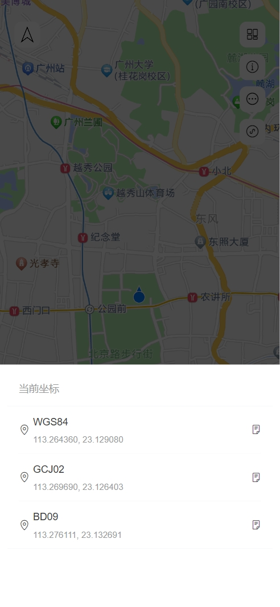

# 地图定位

## 介绍
移动端设备在地图中的方向定位以及快速获取当前位置坐标。




## Setup

Install the dependencies:

```bash
pnpm install
```

## Get Started

Start the dev server:

```bash
pnpm dev
```

Build the app for production:

```bash
pnpm build
```

Preview the production build locally:

```bash
pnpm preview
```
